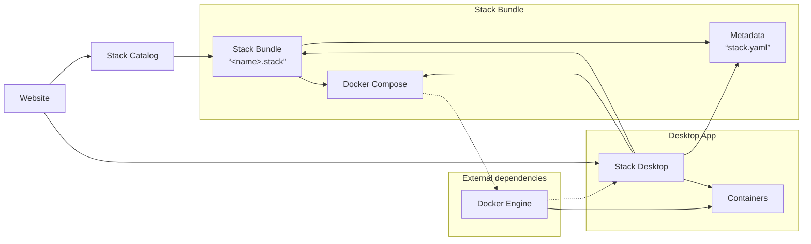
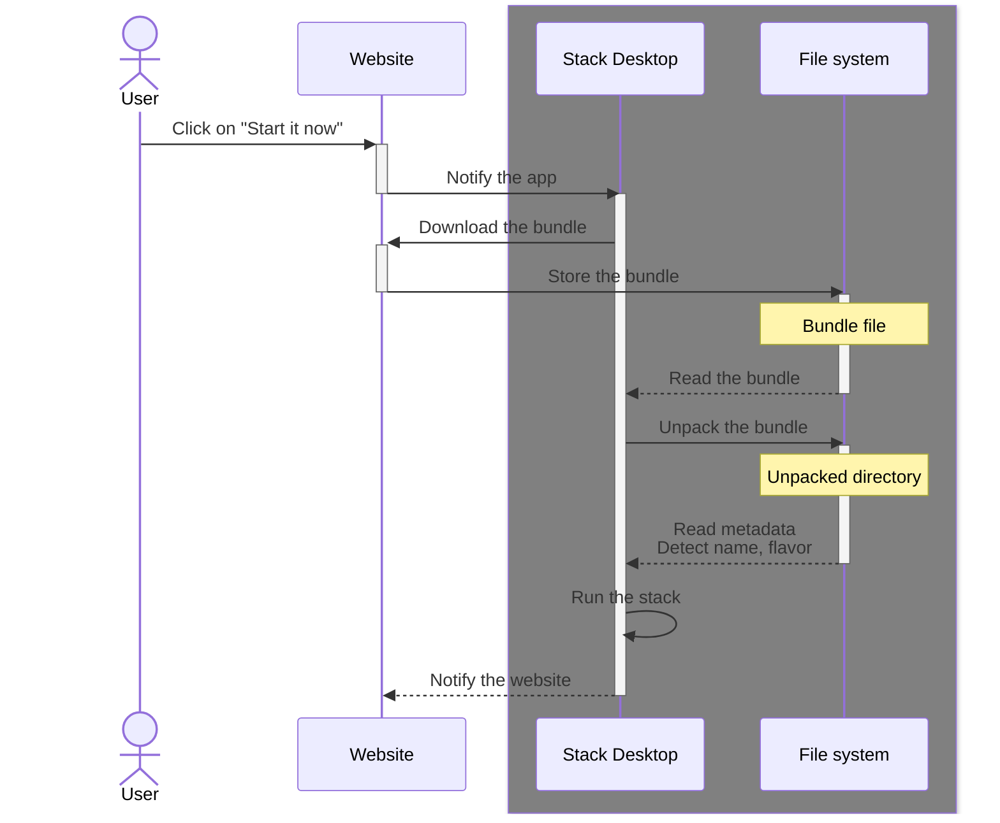

# Internal architecture

## Overview

The _Stack Desktop app_ is a ( mac) desktop app capable of running software stacks. It is built in `Rust` and leverages `Tauri` as the framework and runtime.

It works alongside a _website_ that provides a _catalog_ of software stacks over at <https://stack.lol>.

The _catalog_ is a collection of _stack bundles_ which are compressed archives (`<name>.stack`) each containing a full-fledged software stack. The stack is a collection of software components that work together to provide a specific functionality.

The _website_ is able to notify the _app_ to download and run a software stack from a _stack bundle_.

The _app_ exposes a secured _API_ that the _website_ can use to notify it to download and run a software stack.

### Schema

### API

- `GET` <https://0.0.0.0:57404/health>
  - Returns `OK` if the _app_ is running.
- `POST` <https://0.0.0.0:57404/run>
  - Accepts a JSON payload with the following structure: `{ "slug": "<name>" }`
  - Downloads and runs the software stack from the catalog with the given `<name>`.

## Security

### API Security

The _app_ exposes an API that the _website_ can use to communicate with it. To ensure this communication is secure:

1. [ ] The _app_ generates a self-signed certificate when initializing which is used for HTTPS communication;
2. [x] API connections are restricted to localhost (127.0.0.1) to prevent external network access;
3. [ ] All API requests require authentication using time-limited JWT tokens;
4. [ ] The _website_ and _app_ share a secret key for mutual authentication;

### User Protection

1. [x] The _app_ is signed and notarized for macOS to verify its authenticity;
2. [ ] Users must explicitly approve downloading and running stacks via confirmation dialogs;
3. [ ] User preferences can be configured for trusted stacks to reduce prompts;

### Bundle Security

1. [ ] All stack bundles are digitally signed by the catalog publisher;
2. [ ] Bundle checksums and signatures are verified before extraction;
3. [ ] Downloaded bundles are scanned for potentially malicious content;
4. [ ] Corrupted or tampered bundles are rejected with appropriate error messages;

### Container Isolation

1. [ ] Containers run with minimal required privileges by default;
2. [ ] Resource limits (CPU, memory, network) are enforced for all running stacks;
3. [ ] Volume mounts are restricted to designated directories;
4. [ ] Network access for containers is properly segmented and controlled;
5. [ ] The _app_ monitors running containers for unusual behavior;

## Diagrams

### Run a software stack from a stack bundle

