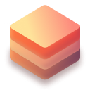

# Stack

**The best free software made accessible.**

---

> [!WARNING]
> This project is in early development and is not ready for production use.

## Motivation

**Everyone deserves great software without friction.** Stack transforms the often complex process of discovering, installing, and managing quality free software into a delightful experience. With our carefully curated collection and one-click installation, we're eliminating barriers between people and the tools they need.

Our mission: make exceptional software accessible to all.

## About

Stack consists of three core components:

| Component          | Description                                        | Action                                        |
| ------------------ | -------------------------------------------------- | --------------------------------------------- |
| 🖥️ **Desktop App** | Install software with a single click               | [↓ Download Now](https://stack.lol/download/) |
| 📚 **Hub**         | Browse our curated collection of 200+ applications | [👀 Explore Hub](/hub/)                       |
| 🌐 **Website**     | Access documentation and resources                 | [→ Visit Website](https://stack.lol)          |

## Features

- [x] 📦 **Software bundles**: Download and run software stacks with `.stack` files
- [x] 👨‍💻 **Desktop app**: [macOS](https://stack.lol/download/mac) (`.dmg`), [Windows](https://stack.lol/download/windows) (`.exe`, `.msi`), [Linux](https://stack.lol/download/linux) (`.AppImage`, `.deb`, `.rpm`)
- [x] 🚀 **One-click installation**: Install software with a single click
- [x] 🔍 **Curated collection**: Access carefully selected free applications (and their alternatives)
  - [x] 🐳 **Docker compose**: Run powerful multi-container applications
  - [x] 🐳 **Containers**: Run single-container applications
  - [x] 📄 **Static sites**: Host websites with zero configuration
  - [ ] 🌱 **Coming soon**: Support for Helm charts, PHP, Python, Node.js, and Go applications
- [x] 🥧 **Recipes**: Create custom application stacks by mixing and matching components
- [ ] 🔒 **Security-focused**: Open-source software vetted against our [security checklist](./ARCHITECTURE.md#security)
- [ ] 🛣 **Roadmap**:
- Self-contained packaging (bundled dependencies)
- Offline installation support
- Automatic updates
- Proxy configuration

## Architecture

See the [ARCHITECTURE.md](./ARCHITECTURE.md) document for an overview of the project's architecture.

## Contributing

We welcome contributions! Check our [CONTRIBUTING.md](./CONTRIBUTING.md) for guidelines.

## License

This repository is available under the [MIT License](./LICENSE_MIT), with the following exception:

- The [packages/app](packages/app) directory is protected under a proprietary license.

## Credits

Stack is led by [arnaud](https://github.com/arnaud), who develops this project openly with support from the community.

  

