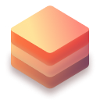

# Stack

**The best free software made accessible.**

---

> [!WARNING]
> This project is in early development and is not ready for production use.

## Motivation

Stack makes accessible the best of the web, and the best of the web is made by the community.

## About

The software is divided into three parts:

### 1. Desktop app

Install stacks of software with a single click on your desktop.

👉 [Download the app](https://stack.lol/download/) (macOS only at the moment)

### 2. Hub

The hub is the software catalog where you can find all the software available in Stack.

👉 [Browse the hub](/hub/)

### 3. Website

The website is the place where you can find all the information about Stack.

👉 <https://stack.lol>

## License

This repository is licensed under the [MIT License](./LICENSE_MIT) ; excepted for the following subfolders:

- [packages/app](packages/app) which is covered by its own proprietary license.
